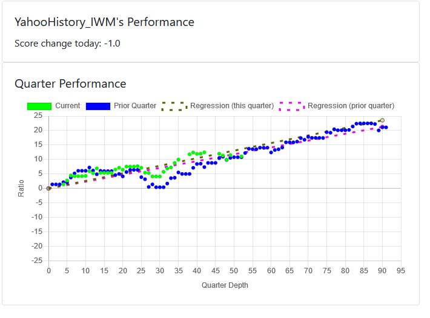
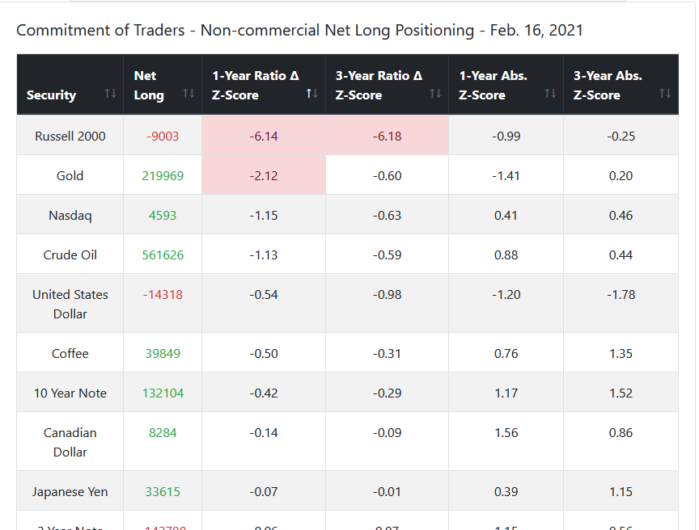
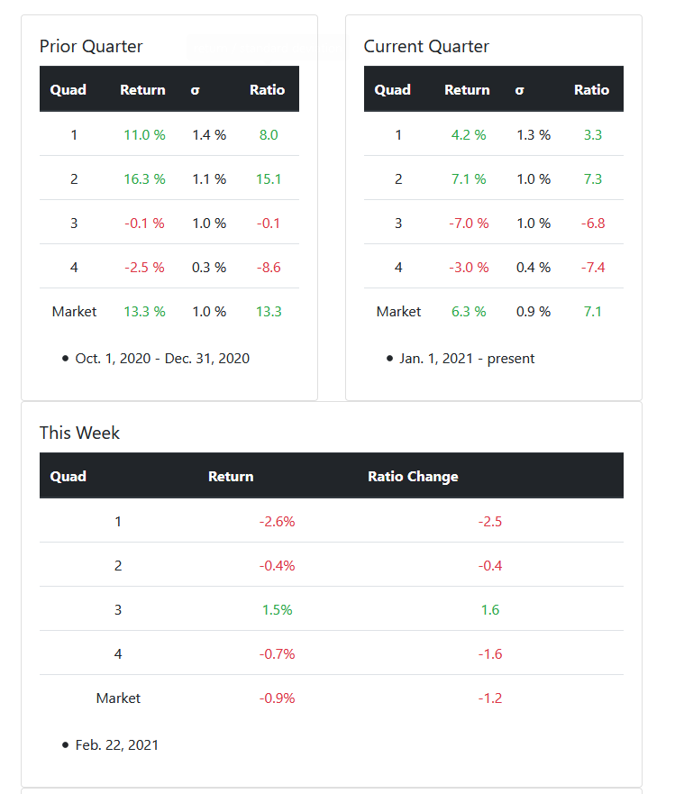
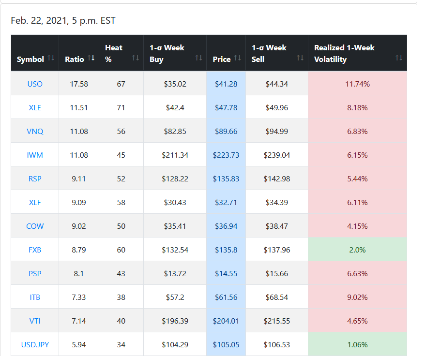

# VolAdjGIPDashboard
Volatility-adjusted positioning based on US growth and inflation. A website dashboard for macro-economics based investment decisions similar to ideas expoused by Ray Dalio. 

The essential axiom underlying it is that the rate of change of inflation and growth determines the optimal portfolio basket. High growth and low inflation is very bullish growth indexes, like the NASDAQ. Low growth and high inflation is bullish gold. 

Volatility-adjusted means that if the desired portfolio contains 3 securities, the size of each position will be such that a standard deviation move results in the same dollar amount change in profit and loss as in any of the other positions. The idea is to have equal dollar risk across the portfolio.

This approach has worked well since 2008 (based on backtesting), though it seems to have been doing very poorly this year (2020). 

# I Don't Think This Strategy Works
Upon further statistical testing in early 2021 I have concluded that there is no statistical relationship between the growth-inflation rate of change regime and the performance of the securities I have chosen for them. The performance is indistinquishable from noise based on a 94% HDI interval in my Bayesian hypothesis tests. My only remaining hope for this project was that a sort of trend-following of the performance score (return/stdev) quarter to date would yield positive results, but they are equivalent to buying and holding a broad US market index. That's cheaper and easier, so I'm going to do that.

I think this model is being fooled by a historic bull run, and has also fallen prey to to problem of multiple comparisons when it comes to security basket selection for particular regimes. 

# Performance History
Performance history charts show the quarter-to-date return divided by the quarter-to-date standard deviation of a security by how late in the quarter we are, compared against the same for the prior quarter.

# Commitment of Traders
The latest CFTC Commitment of Traders data is summarized statistically to put the net long positions of the non-commercials into context historically.

# Status Dashboard
An at-a-glance look at the current quarter-to-date performance of particular baskets of securities, and the week-to-date performance as well for a higher resolution picture. As this is ultimately a low-frequency framework, I wanted to avoid daily data being displayed directly to keep emotions cool.

# Security Summary
A more comprehensive list of various ETFs and currencies, putting their current week-to-date return in context statistically. 

